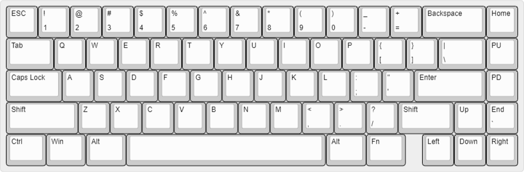

# Mikeneko65
(Japanese version is [here](./README_jp.md))

A simple 65% keyboard for DIYers. This project was forked from [kkatano's Bakeneko65](https://github.com/kkatano/bakeneko-65).

## Updates

### Differences between Bakeneko65 V3 and Mikeneko65

- Changed switch type from soldering to hotswap socket
- Supported for PCB screw-ins stabilizer
- Changed MCU to ATmega32U4-MU(R) to deal with MCU supply shortage
- Added pcb/case/sockeet/switch foam

## Features

- Single piece tray case
- O-ring gasket mount (Friction fit)
- Uses [Unified Daughterboard](https://github.com/ai03-2725/Unified-Daughterboard) and [Simplified Daughterboard](https://github.com/kb-elmo/simplified-daughterboard) as daughterboard
- Supports QMK firmware, VIA, Remap and Vial
- PCB designed with KiCAD 5.1.12

## Layouts

## Buide guide

[Build Guide(English)](https://github.com/takishim/mikeneko65-docs/blob/master/BUILDGUIDE_en.md)

## Specs

- Dimensions: 315 x 110 x 30mm
- Front height: 18.5mm
- Home row height: 31mm(with GMK keycaps and bumpons)
- Typing angle: 6 degree
- Weight: 760g
- O-ring gasket: VMQ-30A AS568-263(softer) or VMQ-50A AS568-264(harder) is recommended

## Notes

- All files are to be used at your own risk

## Firmware & JSON definition file
- [Firmware(VIA Supported)](./mikeneko65_via.hex)
- [Firmware(VIA NOT Supported)](./mikeneko65_default.hex)
- [QMK Source Code](https://github.com/qmk/qmk_firmware/tree/master/keyboards/mikeneko65)
- [VIA Source Code](https://github.com/the-via/keyboards/tree/master/src/mikeneko65)
- [JSON file for VIA/Remap/Vial](./mikeneko65_via.json))
- [JOSN file for KeyboardLayoutEditor](./mikeneko65_kle.json))

You can download firmware and JSON files by right-clicking on the link and selecting "Save link as".

## Community

- Discord: [takishim's server](https://discord.gg/w4NRNrZkBp)
  - Have fun with community members
  - Talk about Mikeneko65 builds and mods, and share your works
  - You can also contact me from there

Please do not ask questions about Mikeneko65 on kkatano's discord server as it will be an inconvenience.

## Special thanks to

- **kkatano** Open-sourced Bakeneko65 and answered my questions in his community
- **desuchan** Allowed me to use the plate he designed
- People who supported the development of Mikeneko65

## Also I should mention
- Many keyboard community members for giving me advice and feedback, really thanks!
