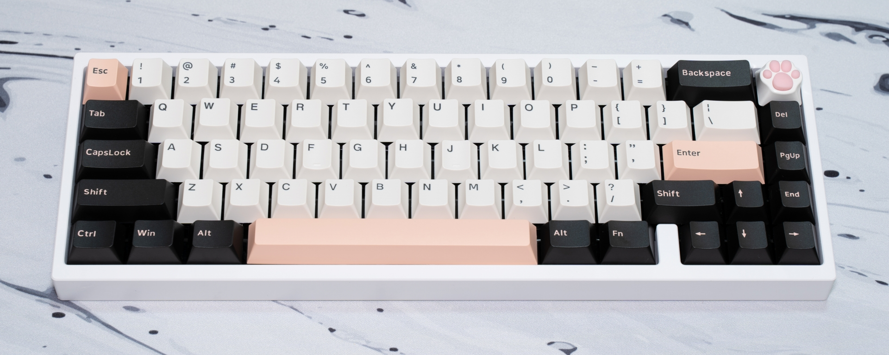

# Mikeneko65
(English version is [here](./README.md))  

Mikeneko65はkkatanoさんが開発・公開している[Bakeneko65(v3)](https://github.com/kkatano/bakeneko-65)からフォークした65%サイズのメカニカルキーボードです。  

Oリングガスケットマウント(フリクションフィット)の特性を活かしつつ、フォームを追加してキーボード内部の隙間や空間を減らすことで、打鍵感と打鍵音を向上させました。

- レビュー動画 [【極上の打鍵感】Mikeneko65 レビュー | Mikeneko65 : Custom Mechanical Keyboard Review](https://www.youtube.com/watch?v=eKG2YrfDjyA)

## OSS版Bakeneko65とMikeneko65の違い
OSS版Bakeneko65(v3)とMikeneko65の主な違いは下記のとおりです。
- ホットスワップソケットに対応、ホットスワップソケット対応に伴い、キーレイアウトを固定化
- プレートの形状を変更し、スクリューインタイプのスタビライザーに対応
- MCUの価格高騰と供給不足に対応するため、MCUをATMeaga32U4-MU(R)に変更
- フォーム(PCBフォーム、ケースフォーム、ソケットフォーム、、スイッチパッド)を追加
- [Remap](https://remap-keys.app/)に対応

ケースのデザインは変更しておらず、OSS版Bakeneko65と互換性があります。  

## 仕様
- サイズ: 315 x 110 x 30mm
- タイピング角度: 6度
- 重量: 760g前後
- Oリング: VMQ-30A AS568-263(柔らかめ)またはVMQ-50A AS568-264(硬め)を推奨

## キーレイアウト

## ビルドガイド
[ビルドガイド(日本語)](https://github.com/takishim/mikeneko65-docs/blob/master/BUILDGUIDE_jp.md)

## ファームウェア & JSON定義ファイル
- [VIA対応ファームウェア](./mikeneko65_via.hex) ・・・ VIAに対応したファームウェアのバイナリファイルです。通常はこちらをご利用ください。
- [VIA非対応ファームウェア](./mikeneko65_default.hex) ・・・ VIAに対応していないファームウェアのバイナリファイルです。
- [QMKソースコード](https://github.com/qmk/qmk_firmware/tree/master/keyboards/mikeneko65)
- [VIAソースコード](https://github.com/the-via/keyboards/tree/master/src/mikeneko65)
- [VIA/Remap/Vial用JSONファイル](./mikeneko65_via.json))
- [KeyboardLayoutEditor用JOSNファイル](./mikeneko65_kle.json))

※ ファームウェアとJSONファイルは、リンクを右クリックして「名前を付けてリンク先を保存」でダウンロードできます

## コミュニティ
Mikeneko65に関する雑談・ご質問・ご意見は[takishimのDiscordサーバー](https://discord.gg/w4NRNrZkBp)でお願いします。  
(kkatanoさんのDiscordサーバーでMikeneko65について問い合わせることはご迷惑になるのでご遠慮ください)

## ライセンス
MIT [英語](https://opensource.org/licenses/MIT) [日本語](https://licenses.opensource.jp/MIT/MIT.html)

## 免責
すべてのファイルは、ご自身の責任においてご利用ください。

## キット販売
[たきしむ工房](https://takishim.com/)でキットを販売しています。

## 謝辞
- **kkatanoさん** ・・・ Bakeneko65のデータをOSSで公開していただいたおかげで、時間を忘れて没頭できる趣味に出会うことができました。
- **desuchanさん** スクリューインに対応したプレートのデータを流用させていただきました。
- **各Discordサーバーの皆さん** ・・・ 様々なことを教えていただき、学ばせていただきました。

## フォトギャラリー

## レビュー動画
[4K Mikeneko65](https://www.youtube.com/watch?v=AP2OyEw8YFc) by KS Japan

[ほぼ週刊キーボードニュース 第161回](https://www.youtube.com/watch?v=gyhsUWAneQQ&t=376s) by ほぼ週刊キーボードニュース

[Mikeneko65 with Gateron Oil King [Sound Test]](https://www.youtube.com/watch?v=dd4mWbpZy44) by Keyboard Test

## レビュー記事
[【レビュー依頼記事】Mikeneko65のレビューをするよ！](https://salicylic-acid3.hatenablog.com/entry/mikeneko65-review) by Salicylic_acid3
